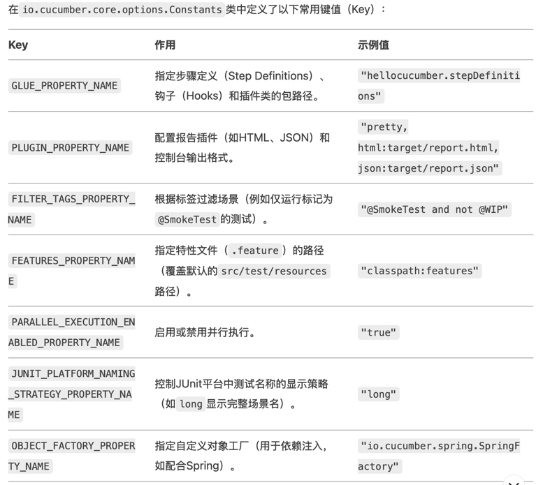

### refer：
https://cucumber.io/docs/guides/browser-automation

Update the is_it_friday_yet.feature file. 
Notice how we go from `Scenario` to `Scenario Outline` when we start using multiple `Examples`.

### 测试用例执行
- 执行顺序
- parallel execution
- multithrea execution
  - single api
  - case scenario
- 执行优先级
- 批量执行
- test report
- cicd

mvn test  -Dcucumber.options=""

mvn test  -Dcucumber.options="--help"

mvn test  -Dcucumber.options="feature_path"

mvn test  -Dcucumber.options="feature_path:line_number"
mvn test  -Dcucumber.options="--tag@smoke"
mvn test  -Dcucumber.options="-t @smoke"
mvn test  -Dcucumber.options="-p html:target/HtmlReport"

核心配置参数列表

在io.cucumber.core.options.Constants类中定义了以下常用键值（Key）：

table

Key	作用	示例值
|GLUE_PROPERTY_NAME | 指定步骤定义（Step Definitions）、钩子（Hooks）和插件类的包路径。| "hellocucumber.stepDefinitions"
PLUGIN_PROPERTY_NAME |	配置报告插件（如HTML、JSON）和控制台输出格式。|	"pretty, html:target/report.html, json:target/report.json"
FILTER_TAGS_PROPERTY_NAME	根据标签过滤场景（例如仅运行标记为@SmokeTest的测试）。	"@SmokeTest and not @WIP"
FEATURES_PROPERTY_NAME	指定特性文件（.feature）的路径（覆盖默认的src/test/resources路径）。	"classpath:features"
PARALLEL_EXECUTION_ENABLED_PROPERTY_NAME	启用或禁用并行执行。	"true"
JUNIT_PLATFORM_NAMING_STRATEGY_PROPERTY_NAME	控制JUnit平台中测试名称的显示策略（如long显示完整场景名）。	"long"
OBJECT_FACTORY_PROPERTY_NAME	指定自定义对象工厂（用于依赖注入，如配合Spring）。	"io.cucumber.spring.SpringFactory"
ANSI_COLORS_DISABLED_PROPERTY_NAME	禁用控制台输出的ANSI颜色（适用于不支持颜色的环境）。	"true"
EXECUTION_DRY_RUN_PROPERTY_NAME	启用“干运行”模式（仅检查步骤定义是否匹配，不执行实际代码）。	"true"